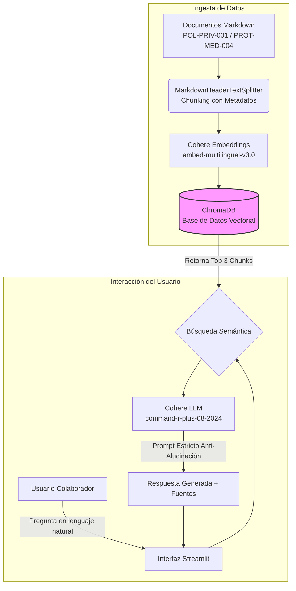
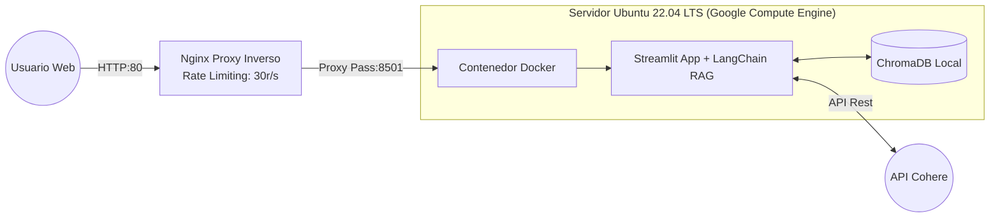
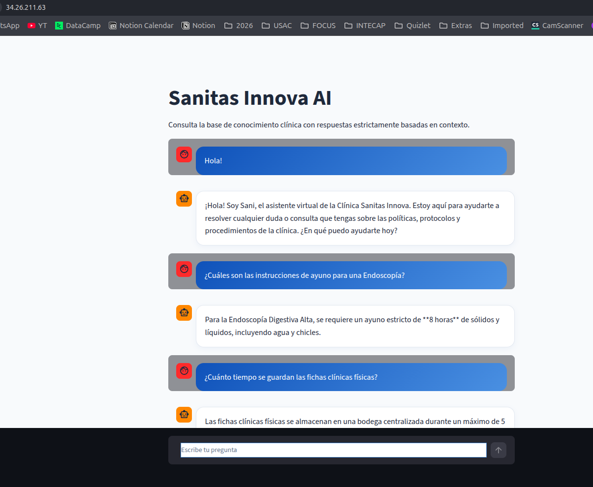
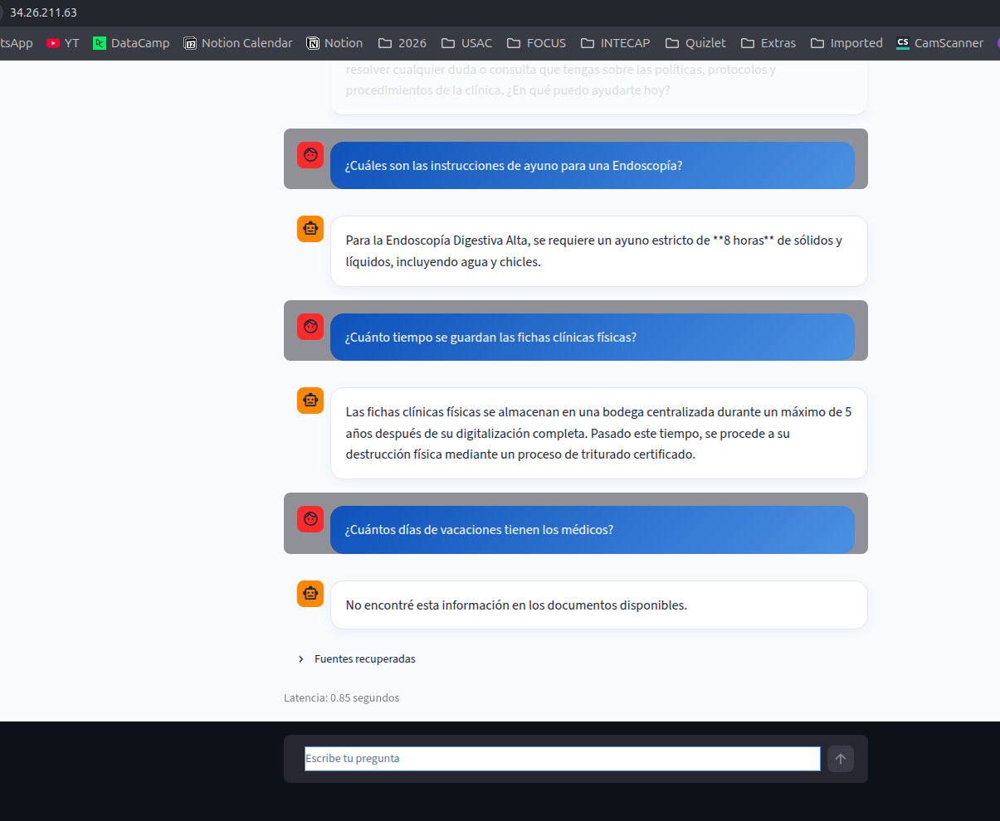

# 🩺 Alura Agente: Asistente de IA para Clínica "Sanitas Innova"

Este repositorio contiene la solución completa para el **Challenge Alura Agente**, que consiste en un agente de Inteligencia Artificial corporativo optimizado para resolver consultas de los colaboradores de la clínica **Sanitas Innova**. El agente utiliza una arquitectura RAG (Retrieval-Augmented Generation) para responder preguntas complejas y precisas basadas exclusivamente en la política de privacidad de datos del paciente (POL-PRIV-001) y en las instrucciones pre y post-consulta (PROT-MED-004).

---

## Arquitectura de la Solución

El sistema está diseñado en módulos débilmente acoplados que separan la ingesta de documentos, el motor de recuperación y la interfaz de usuario. El despliegue en la nube se apoya en Docker, Nginx y una instancia de Google Compute Engine para mantener el acceso controlado y estable.

### Diagrama de Flujo RAG (Generación Aumentada por Recuperación)



### Arquitectura de Despliegue en la Nube (GCP)



---

## 🛠️ Stack Tecnológico

El agente está construido con herramientas modernas, modulares y de alto rendimiento en el ecosistema de IA:

- **Lenguaje Base:** Python 3.12
- **Framework de IA:** LangChain
- **Modelos de Lenguaje (LLM):** Cohere (`command-r-plus-08-2024` y `embed-multilingual-v3.0`)
- **Base de Datos Vectorial:** ChromaDB
- **Procesamiento de Documentos:** `MarkdownHeaderTextSplitter` para mantener la integridad de las tablas y secciones
- **Interfaz Gráfica:** Streamlit
- **Contenerización:** Docker y Docker Compose
- **Despliegue y Seguridad:** Google Cloud Platform (Compute Engine), Nginx (proxy inverso) y Fail2Ban

---

## 💻 Instrucciones para Ejecutar el Proyecto

### Opción 1: Ejecución Rápida (Docker Compose)

1. Clona el repositorio:

```bash
git clone https://github.com/MarceJua/alura-agente-ia.git
cd alura-agente-ia
```

2. Crea el archivo `.env` en la raíz y añade tu llave de Cohere:

```
COHERE_API_KEY=tu_clave_aqui
```

3. Construye y levanta el contenedor:

```bash
docker-compose up -d --build
```

4. Abre tu navegador en `http://localhost:8501`.

### Opción 2: Desarrollo Local (Entorno Virtual)

1. Crea y activa tu entorno virtual:

```bash
python -m venv venv
source venv/bin/activate
```

2. Instala las dependencias:

```bash
pip install -r requirements.txt
```

3. Crea la base de datos vectorial ejecutando la ingesta:

```bash
python src/vector_store.py
```

4. Inicia la aplicación:

```bash
streamlit run app.py
```

---

## ❓ Ejemplos de Preguntas y Respuestas del Agente

El agente cuenta con reglas estrictas para garantizar respuestas fidedignas o disparar un mensaje de contención (_fallback_) si la información no existe en la base de conocimientos.

**Pregunta 1 (Extracción desde Tablas):**

> **Usuario:** _¿Cuáles son las instrucciones de ayuno para una Endoscopía?_
> **Agente:** Para la preparación de una Endoscopía Digestiva Alta, se requiere un ayuno estricto de **8 horas**, absteniéndose de consumir sólidos y líquidos, incluyendo agua y chicles. Además, se deben suspender los antiácidos 24 horas antes.

**Pregunta 2 (Política de Retención):**

> **Usuario:** _¿Cuánto tiempo se guardan las fichas clínicas físicas?_
> **Agente:** Según el documento POL-PRIV-001, las fichas clínicas físicas e históricas en papel se almacenan en bodega centralizada durante un máximo de **5 años** tras su digitalización, luego de lo cual se destruyen mediante triturado certificado.

**Pregunta 3 (Manejo de Alucinaciones - Información Inexistente):**

> **Usuario:** _¿Cuántos días de vacaciones tienen los médicos?_
> **Agente:** No encontré esta información en los documentos disponibles.

---

## ☁️ Evidencia del Deploy en la Nube

_Nota: Por motivos de optimización de créditos promocionales y disponibilidad de instancias (Agotamiento de cuota Ampere A1), la aplicación se desplegó utilizando **Google Cloud Platform (GCP)** en lugar de OCI, manteniendo los mismos estándares de contenedorización._

**Aplicación En Vivo:**
🔗 [**http://34.26.211.63**](https://www.google.com/search?q=http://34.26.211.63)

**Captura de Pantalla del Funcionamiento:**



---

## 📊 Registro de Ejecución (Logs locales en producción)

El agente registra cada una de las interacciones en un archivo estructurado local `logs/agent_execution.jsonl` bajo el siguiente formato para permitir la auditoría de respuestas:

```json
{
  "timestamp": "2026-07-10T22:35:11-07:00",
  "query": "¿Por cuánto tiempo se guardan las fichas en papel?",
  "response": "De acuerdo con el documento POL-PRIV-001, las fichas físicas se conservan por 5 años y luego se destruyen con trituración industrial certificada.",
  "source_documents": ["POL-PRIV-001"],
  "latency_seconds": 1.45,
  "status": "SUCCESS"
}
```
